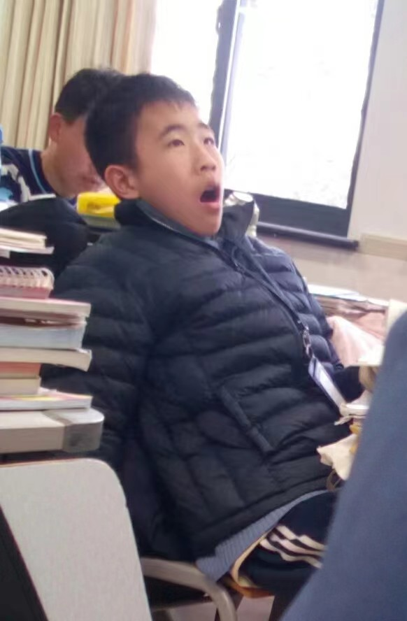

# 关于古猿

## 照片

- 
- 
- 
- 

## 名称

- 中文名：王昊宸
- 外文名：Tom[^1]
- 学名：[古猿, ancient ape](./dictionary.md)
- **曾经的**外号：王耗子
- 小名：乐乐

## 习性

- 栖息地：[杭州外国语学校 (HFLS)](./habitat.md)，小和山，博物馆
    - 学号：0101237035256，8（幸运数字）
    - 班级：2023级7班，初一7班$\Rightarrow$初二7班
    - 小学：[采荷一小？](./img/about5.jpg)
- 起源：小和山大猩猩变异
- 主要食物：烂香蕉 (rotten banana)
- 喜好：给别人起**侮辱性**外号[^2]

## 爱与恨

- 暗恋：17 ~~，42，29~~（之前还有20）
- 害怕：38

## 名言

- 科学课：小米、大脑切片
- 英语课：trivel
- 社会课：北伐
- 平时：番\~薯\~

## 外号对照表

|学号|外号|
|:-:|:-:|
|7|0scar|
|9|ccc|
|11|千年老蛙|
|12|鼠猴精|
|16|王带鱼|
|17|土番（拔）薯|
|25|废土|
|26|三文鱼|
|29|施圣土|
|37|暗恋 roast Kiki|
|38|Lu狗|
|41|扬子鳄|

## 化学反应

- 分解：$GuYuan \xrightarrow{用烂香蕉轰击} Ga + Y + 2U$
- 合成：$Mo + T \xrightarrow{178 {^\circ C} 高温} Tom$

## 职业推荐

- 考古学[^3]

## 古猿诗

详见[这里](./docs.md)

## 家庭

- 爷爷：丁晨曦
- ~~奶奶：王圣茹~~

[^1]: 法语发音类似Dom
[^2]: 注意！古猿的行为是**民事违法行为**，请勿模仿！违反了[民法典](https://flk.npc.gov.cn/detail2.html?ZmY4MDgwODE3MjlkMWVmZTAxNzI5ZDUwYjVjNTAwYmY%3D)第一千零二十五条：“行为人为公共利益实施新闻报道、舆论监督等行为，影响他人名誉的，不承担民事责任，但是有下列情形之一的除外：（一）捏造、歪曲事实；（二）对他人提供的严重失实内容未尽到合理核实义务；**（三）使用侮辱性言辞等贬损他人名誉。**”
[^3]: 详情请问 ~~Amanda~~ Simon