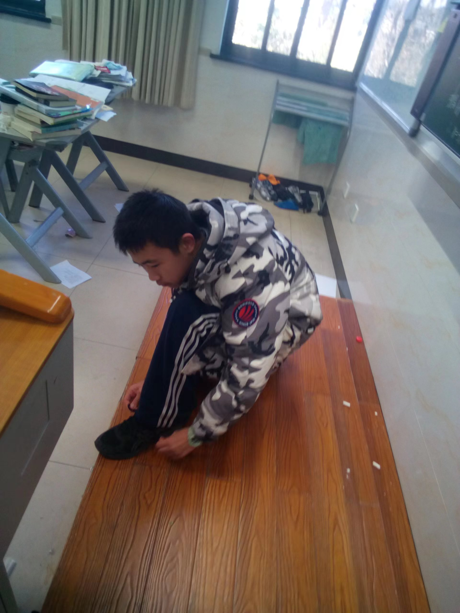

# 关于古猿

## 照片

- 
- 
- 
- 
- 

## 名称

- 中文名：王昊宸
- 外文名：Tom[^1]
- 学名：[古猿, ancient ape](./dictionary.md)
- **曾经的**外号：王耗子
- 小名：乐乐

## 习性

- 栖息地：[杭州外国语学校 (HFLS)](./habitat.md)，小和山，博物馆
    - 学号：0101237035256，8（幸运数字）
    - 班级：2023级7班，~~初一7班~~$\rightarrow$初二7班
    - 小学：[采荷一小？](./files/about5.jpg)
- 起源：小和山大猩猩变异
- 主要食物：烂香蕉 (rotten banana)
- 喜好：给别人起**侮辱性**外号[^2]
- 其他：放屁很臭

## 爱与恨

- 暗恋：17<del>，42，29</del>（之前还有20）
- 害怕：[38](./the-first-heroic-person-who-fought-against-the-ancient-ape.md)

## 名言

- 科学课：小米、大脑切片
- 英语课：trivel
- 社会课：北伐
- 平时：番\~薯\~

## 古猿的发音

|原文|古猿的发音|正确发音|
|:-:|:-:|:-:|
|$\sin$|sing|sine|
|$\cos$|口撒|cosine|
|$\tan$|贪勾|tangent|
|环戊烷|环戍院|-|

## 外号对照表

|学号|外号|
|:-:|:-:|
|7|0scar|
|9|ccc|
|11|千年老蛙|
|12|鼠猴精，（瘦）猴精，金属猴|
|16|王带鱼|
|17|土番（拔）薯[^3]|
|25|（臭）废土|
|26|（三/老）文鱼，文三鱼，大马哈鱼|
|29|（施）圣土|
|30|大萝卜，萝卜头|
|31|（臭）暗迪|
|34|常狗|
|37|暗恋 roast Kiki|
|38|Lu狗（狗）|
|41|扬子鳄，克劳克代油|

## 化学反应

- 分解：$GuYuan \xrightarrow{用烂香蕉轰击} Ga + Y + 2U$
- 合成：$Mo + T \xrightarrow{178 {^\circ C} 高温} Tom$
- 更多详见[古猿题](./docs.md#_4)

## 职业推荐

- 考古学[^4]

## 古猿诗

详见[古猿诗词](./docs.md#_2)

## 家庭

- 爷爷/老古猿：丁晨曦
- ~~奶奶：王圣茹~~
- 小古猿：周子博

## 分类

- 海哥学生？ :x:[^5]
- 养殖动物？ :x:
- 野生动物？ :white_check_mark:

!!! tip "生活小妙招"
    不要说脏话！没什么是“你个古猿”解决不了的。

[^1]: 法语发音类似Dom
[^2]: 注意！古猿的行为是**违法行为**，请勿模仿！违反了①《宪法》第三十八条 中华人民共和国公民的人格尊严不受侵犯。**禁止用任何方法对公民进行侮辱、诽谤和诬告陷害**。
②《民法典》第一千零二十四条 民事主体享有名誉权。任何组织或者个人**不得以侮辱、诽谤等方式侵害他人的名誉权**。
③《治安管理处罚法》第四十二条 有下列行为之一的，处五日以下拘留或者五百元以下罚款；情节较重的，处五日以上十日以下拘留，可以并处五百元以下罚款：（一）写恐吓信或者以其他方法威胁他人人身安全的；**（二）公然侮辱他人或者捏造事实诽谤他人的；**（三）捏造事实诬告陷害他人，企图使他人受到刑事追究或者受到治安管理处罚的；（四）对证人及其近亲属进行威胁、侮辱、殴打或者打击报复的；（五）多次发送淫秽、侮辱、恐吓或者其他信息，干扰他人正常生活的；（六）偷窥、偷拍、窃听、散布他人隐私的。
~~④《刑法》第二百四十六条 【侮辱罪、诽谤罪】**以暴力或者其他方法公然侮辱他人或者捏造事实诽谤他人**，情节严重的，处三年以下有期徒刑、拘役、管制或者剥夺政治权利。前款罪，告诉的才处理，但是严重危害社会秩序和国家利益的除外。通过信息网络实施第一款规定的行为，被害人向人民法院告诉，但提供证据确有困难的，人民法院可以要求公安机关提供协助。~~
[^3]: 无侮辱性
[^4]: 详情请问Simon
[^5]: 海哥最近说它“心智、行为比以前成熟。”
